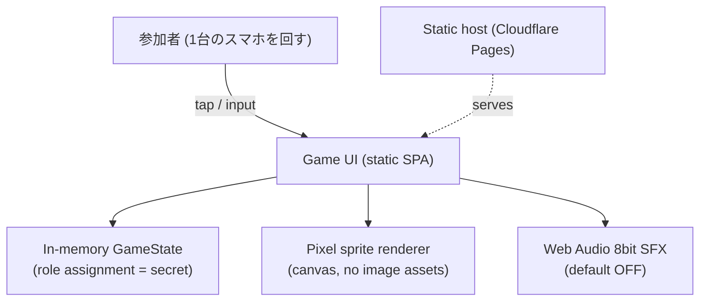
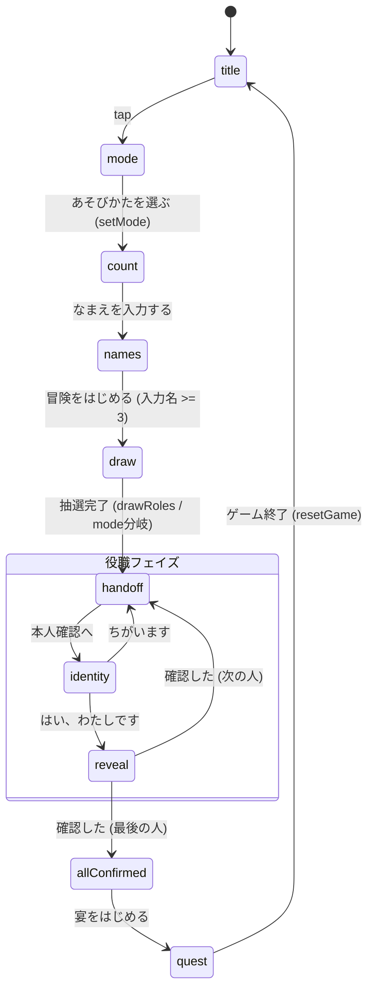

# にゃんろう-猫狼- — Architecture

Client-only party game. No backend, no persistence, no network. All state lives in
one in-memory store (`src/state.ts`) for the lifetime of a single browser session.

## 1. System context

External communication guarantees: **none**. The app makes zero network requests at
runtime. No analytics, no fonts, no CDN. This is a deliberate secrecy property — role
data can never leave the device because there is no channel for it to leave through.

## 2. Screen state machine

役職フェイズのみ。`mode` 画面で役職構成（standard=全役職 / simple=猫狼と野良猫だけ）を選び、
`composeRoles(playerCount, mode)` が分岐する。参加人数は `names` 画面で登録された名前の数で
決まる（`setNames` が `playerCount` を確定＝names が唯一の真実）。アクションカードは
フィジカル運用のためアプリには実装しない。

## 3. Component responsibility

| Module | Responsibility |
|---|---|
| `state.ts` | 単一の状態機械。役職割当を保持（秘匿）。参加人数は登録名の数で確定。localStorage/URLに書かない。 |
| `roles.ts` | 役職定義＋人数別構成（`composeRoles(count, mode)`, single source of truth）。simpleは猫狼と野良猫だけ。 |
| `router.ts` | 画面差し替え。履歴/URLを使わない（バックで役職を復元させない）。 |
| `pixel.ts` | スプライトをデータから canvas 生成。役職名を含む画像/URLが存在しない。 |
| `sfx.ts` | 共通効果音のみ。役職固有音は鳴らさない（周囲に漏らさない）。 |
| `dom.ts` | textContent ベースの DOM 生成。innerHTML 不使用（XSS経路ゼロ）。 |
| `screens/*` | 各画面の描画とイベント。 |

## 4. 役職秘匿の保証（実装上の最優先要件）

仕様 section 18 を機械的に満たすための不変条件。

| # | 要件 | 実装 |
|---|---|---|
| 1 | 役職ごとに読み込み時間を変えない | `reveal.ts` のタイムライン `T_OPEN`/`T_CARD` は役職非依存の定数 |
| 2 | 役職表示前の画面色を変えない | テーマ色は `.role-card` にのみ適用。暗転〜宝箱の見た目は全役職共通 |
| 3 | 役職別画像を本人確認前に読み込まない | スプライトは `reveal` 到達時に canvas 生成。事前読込なし |
| 4 | ファイル名/URLに役職名を出さない | 画像アセットを一切持たない（`.png`/`.gif` 参照ゼロ） |
| 5 | 確認後は同じ参加者の画面を再表示できない | 確認後 `card.remove()` で DOM から役職を破棄。履歴を使わずバック不可 |
| 6 | 効果音で周囲に役職が伝わらない | `reveal` は共通音のみ。役職固有音は未実装 |
| 7 | 毛色と役職を連動させない | `furColors` は `state.ts` でランダム付与。`roles` と独立 |
| 8 | 受け渡し画面は全員同一 | `handoff.ts` は名前以外を出さない。背景・色・演出は共通 |
| 9 | クエスト画面で構成を開示しない | `quest.ts` は人数のみ表示。役職一覧/人数比を出さない |

アクションカードはフィジカル（紙）運用のためアプリには実装しない。特殊役職の指示は
役職確認画面（`reveal.ts`）の能力文で本人にのみ伝わる。

自動検証（`playwright` によるフロー走査）で 5/6/9 のDOM漏洩を毎回アサートできる。
`grep -rn "localStorage\|sessionStorage\|location.hash" src/` が空であることも不変条件。
